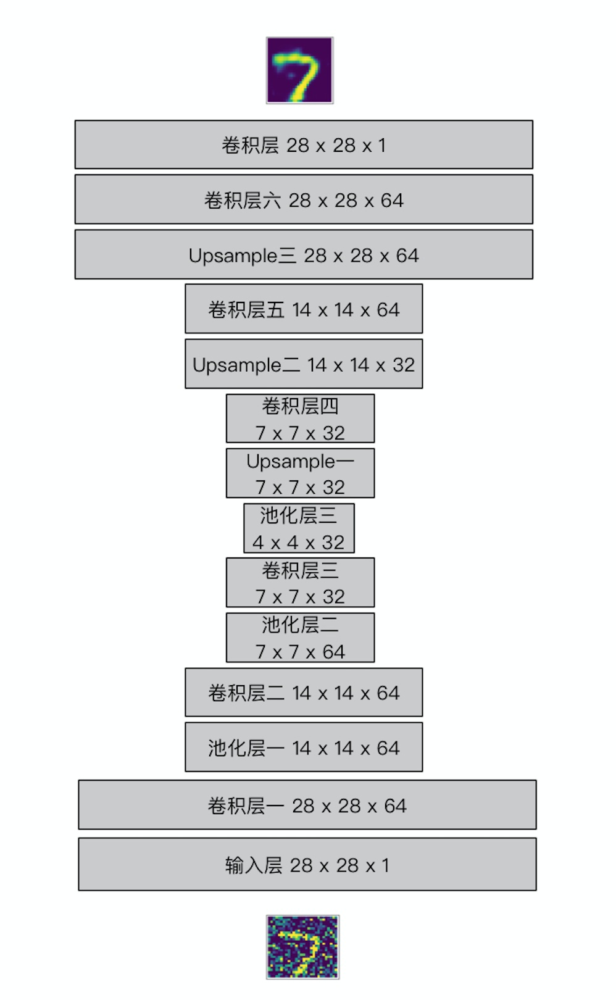

# FCN
### 图像的降噪

##### 最近发现设计的网络的分类正确率一直上不去，将那些分类错误的图片拿出来进行比较，发现原数据集的图片噪声较大，所以写一个全卷积自编码器进行图像的降噪
1. 网路的结构如下：
 

2. 网络结构说明

2.1 第一部分：Encoder卷积层

Encoder卷积层设置了三层卷积加池化层，对图像进行处理。

第一层卷积中，我们使用了64个大小为3 x 3 的滤波器（filter），strides默认为1，padding设置为same后我们的height和width不会被改变，因此经过第一层卷积以后，我们得到的数据从最初的28 x 28 x 1 变为 28 x 28 x 64。

紧接着对卷积结果进行最大池化操作（max pooling），这里我设置了size和stride都是2 x 2，池化操作不改变卷积结果的深度，因此池化以后的大小为 14 x 14 x 64。

对于其他卷积层不再赘述。所有卷积层的激活函数都是用了ReLU。

经过三层的卷积和池化操作以后，我们得到的conv3实际上就相当于上一部分中AutoEncoder的隐层，这一层的数据已经被压缩为4 x 4 x 32的大小。

至此，我们就完成了Encoder端的卷积操作，数据维度从开始的28 x 28 x 1变成了4 x 4 x 32。

2.2 Decoder卷积层

在Decoder端，我们并不是单纯进行卷积操作，而是使用了Upsample（中文翻译可以为上采样）+ 卷积的组合。

我们知道卷积操作是通过一个滤波器对图片中的每个patch进行扫描，进而对patch中的像素块加权求和后再进行非线性处理。举个例子，原图中我们的patch的大小假如是3 x 3（说的通俗点就是一张图片中我们取其中一个3 x 3大小的像素块出来），接着我们使用3 x 3的滤波器对这个patch进行处理，那么这个patch经过卷积以后就变成了1个像素块。在Deconvolution中（或者叫transposed convolution）这一过程是反过来的，1个像素块会被扩展成3 x 3的像素块。

但是Deconvolution有一些弊端，它会导致图片中出现checkerboard patterns，这是因为在Deconvolution的过程中，滤波器中会出现很多重叠。为了解决这个问题，有人提出了使用Upsample加卷积层来进行解决。

关于Upsample有两种常见的方式，一种是nearest neighbor interpolation，另一种是bilinear interpolation。

在TensorFlow中也封装了对Upsample的操作，我们使用resize_nearest_neighbor对Encoder卷积的结果resize，进而再进行卷积处理。经过三次Upsample的操作，我们得到了28 x 28 x 64的数据大小。最后，我们要将这个结果再进行一次卷积，处理成我们原始图像的大小。

最后一步定义loss和optimizer。

2.3 构造噪声数据

通过上面的步骤我们就构造完了整个卷积自编码器模型。由于我们想通过这个模型对图片进行降噪，因此在训练之前我们还需要在原始数据的基础上构造一下我们的噪声数据。

我们通过上面一个简单的例子来看一下如何加入噪声，我们获取一张图片的数据img（大小为784），在它的基础上加入噪声因子乘以随机数的结果，就会改变图片上的像素。接着，由于MNIST数据的每个像素数据都被处理成了0-1之间的数，所以我们通过numpy.clip对加入噪声的图片进行clip操作，保证每个像素数据还是在0-1之间。

2.4 训练数据

2.5 数据可视化

#### 总结：
  最开始只是理解了全卷积的机制，以为是要自己写反卷积的代码，最后发现tensorflow里面有可以实现反卷积的函数可以调用，代码写起来也比较方便，知乎上也有网络架构图，感觉这次尝试还是很轻松的。
  另一方面，在这次尝试中，我对用matplotlib绘图有了更细致的认识。

##### 慢慢习练这一门手艺